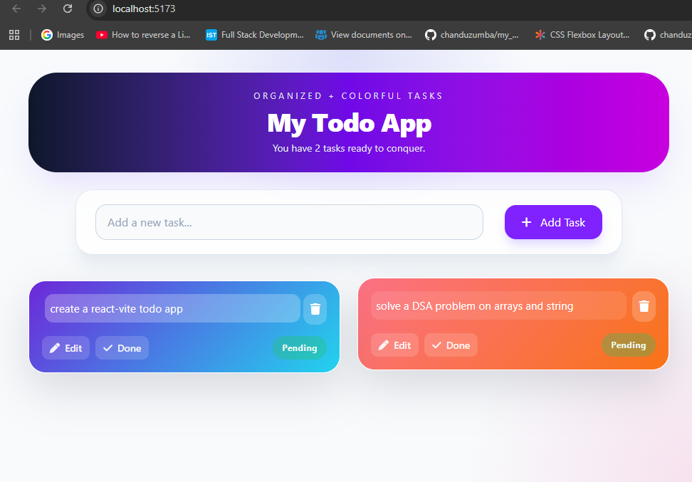

# Todo App

A simple and responsive Todo Application built using React.js that helps users manage daily tasks efficiently.

## Features

-  Add new tasks
-  Mark tasks as completed
-  Delete tasks
-  Edit tasks
-  Clean and minimal UI
-  Fast and responsive design

## Tech Stack

- React.js
- JavaScript (ES6+)
- TailwindCSS
- CSS3
- HTML5

## Project Structure

```bash
src/
│── components/
    │── Header.jsx
    │── TodoList.jsx
    │── ToDo.jsx
│── App.jsx
│── index.css
│── main.jsx
index.html
```

## Preview

```md

```

## Installation & Setup

Clone the repository:

```bash
git clone https://github.com/chanduzumba/todo-app.git
```

Navigate to the project folder:

```bash
cd todo-app
```

Install dependencies:

```bash
npm install
```

Start the development server:

```bash
npm run dev
```

The app will run on:

```bash
http://localhost:5173
```

## Learning Outcomes

Through this project, I practiced:

- React component structure
- State management using Hooks
- Event handling
- Conditional rendering
- Responsive UI development


## Author

Chandrika Prakash

- GitHub: https://github.com/chanduzumba
- LinkedIn: https://www.linkedin.com/in/chandrika-prakash-06723a266/
- Check it out live on : https://todo-app-orcin-rho.vercel.app/

